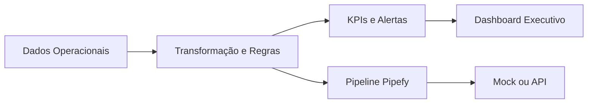

# Central de Automação e Operações

[](https://www.python.org/) [](https://streamlit.io/) [](https://www.pipefy.com/) [](https://github.com/samuelmaia-analytics/central-automacao-operacoes/actions/workflows/ci.yml)

Produto analítico para monitoramento de workflows, SLA, backlog, gargalos operacionais e alertas automatizados.

## O que este projeto entrega
- Monitoramento executivo de operação (SLA, risco, backlog e produtividade).
- Camada de inteligência em Python/SQL/Streamlit.
- Integração Pipefy como camada operacional (API real ou modo demonstração).
- Regras automáticas para alertas, criticidade e recomendação de ação.

## Arquitetura (resumo)


## Principais módulos
- `dashboard/app.py`: visão executiva e navegação principal.
- `dashboard/pages/pipefy_workflow_intelligence.py`: inteligência operacional com Pipefy.
- `integrations/pipefy/`: client GraphQL, queries, mapper e pipeline.
- `src/automation/pipefy_rules.py`: motor de regras operacionais.

## Como rodar localmente
```bash
pip install -r requirements.txt
python -m integrations.pipefy.pipefy_pipeline
streamlit run dashboard/app.py
```

## Variáveis de ambiente
```bash
PIPEFY_TOKEN=
PIPEFY_PIPE_ID=
USE_PIPEFY_MOCK=true
APP_DATA_MODE=pipefy
```

Observação: quando `tickets_enriched.csv` não está disponível (ex.: Streamlit Cloud), o app usa automaticamente `data/samples/tickets_enriched_portfolio.csv` como base legada de demonstração.

## Deploy no Streamlit Cloud
Entrada do app: `dashboard/app.py`

Secrets recomendados:
- `APP_DATA_MODE=pipefy`
- `USE_PIPEFY_MOCK=true`
- `PIPEFY_PIPE_ID=<id_do_pipe>`
- `PIPEFY_TOKEN=<opcional>`

## KPIs e capacidades
- Total de cards/processos
- % dentro do SLA
- Backlog aberto e cards vencidos
- Demandas críticas e sem responsável
- Índice de Saúde Operacional
- Alertas automatizados com exportação CSV

## Portfólio e entrevista
Este projeto demonstra capacidade de:
- integrar ferramenta de workflow (Pipefy) com camada analítica;
- transformar dados operacionais em decisões executivas;
- estruturar produto de dados com visão de negócio e automação.

## Documentação técnica
- [Integração Pipefy](docs/pipefy_integration.md)
- [Modelo de Workflow Pipefy](docs/pipefy_workflow_model.md)
- [Regras de Automação Pipefy](docs/automation_rules_pipefy.md)
- [Arquitetura do Projeto](docs/project_architecture.md)

## Licença
Projeto privado e proprietário. Veja [LICENSE](LICENSE).
