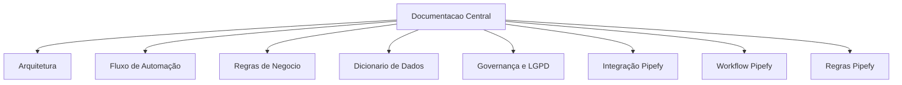

# Documentação

## Índice
- [Arquitetura do Projeto](project_architecture.md)
- [Fluxo de Automação](automation_flow.md)
- [Regras de Negócio](business_rules.md)
- [Dicionário de Dados](data_dictionary.md)
- [Governança de Dados](data_governance.md)
- [LGPD e Privacidade](lgpd_compliance.md)
- [Integração Pipefy](pipefy_integration.md)
- [Modelo de Workflow Pipefy](pipefy_workflow_model.md)
- [Regras de Automação Pipefy](automation_rules_pipefy.md)

## Objetivo
Consolidar decisões de arquitetura, regras operacionais e diretrizes de governança/compliance para sustentação da **Central de Automação e Operações** como produto analítico.

## Dashboard como Produto Analítico
O dashboard foi projetado para operação executiva com:
- visão executiva com KPIs e índice de saúde operacional;
- monitoramento de SLA, backlog e gargalos;
- alertas automatizados e ações recomendadas;
- inteligência operacional integrada ao Pipefy (API real ou modo demonstração).

## Mapa da Documentação

## Template padrão adotado
Todos os documentos principais seguem a estrutura:
- Objetivo
- Escopo
- Entradas
- Saídas
- Riscos
- Controles
