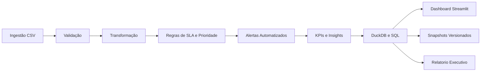

# Fluxo de Automação

## Objetivo
Documentar a sequência operacional da solução, da ingestão ao consumo em dashboard e relatório.

## Escopo
- Processamento batch local com Python + DuckDB.
- Regras de SLA, priorização e alertas.
- Entregáveis analíticos para monitoramento operacional.

## Entradas
- CSV bruto de tickets.
- Configurações de SLA e regras de negócio.
- Parâmetros de execução (incremental, watermark, referência temporal).

## Saídas
- Dataset tratado e enriquecido.
- Tabela analítica em DuckDB.
- Alertas operacionais para exportação.
- Relatório executivo em Markdown.
- Visualização no Streamlit.

## Riscos
- Dados incompletos ou com datas inconsistentes.
- Filtros excessivos no dashboard retornando vazio.
- Reprocessamento sem controle de idempotência.

## Controles
- Validação de colunas obrigatórias e duplicidade de ID.
- Qualidade de dados com resumo auditável.
- Upsert incremental idempotente.
- Snapshots versionados e manifests de execução.
- Mensagens amigáveis no dashboard para base vazia.

## Diagrama do fluxo

