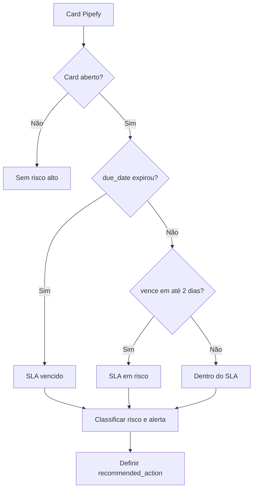

# Central de Automação e Operações - Regras de Automação Pipefy

## Regras de SLA
1. **SLA vencido**
   - `due_date < agora` e card aberto.
2. **SLA em risco**
   - `due_date` vence em até 2 dias e card aberto.

## Regras de risco
1. **Card parado**
   - Card aberto sem atualização por muitos dias (threshold padrão: 5).
2. **Demanda sem responsável**
   - `assignee` vazio ou `Unassigned`.
3. **Prioridade crítica**
   - Prioridade `Crítica`; ou
   - card vencido em fase inicial (`Nova solicitação`, `Triagem`, `Em análise`).
4. **Gargalo de workflow**
   - concentração alta de cards em uma fase (>=35% do aberto e pelo menos 3 cards).

## Regras de recomendação automática
Com base no alerta gerado:
- `SLA vencido` -> **Priorizar atendimento**
- `Sem responsável` -> **Atribuir responsável**
- `Prioridade crítica` -> **Escalar para liderança**
- `Gargalo de workflow` -> **Redistribuir demanda**
- `Card parado` -> **Revisar processo**
- fase `Aguardando cliente` -> **Aguardar retorno do cliente**
- demais casos -> **Encerrar ou atualizar status**

## Motor de regras (Mermaid)

## Colunas geradas
- `sla_status`
- `risk_level`
- `automation_alert`
- `recommended_action`

## Exemplos práticos
- Card sem dono e vencendo amanhã: `SLA em risco`, `Médio`, `Sem responsável`, ação `Atribuir responsável`.
- Card crítico vencido em triagem: `SLA vencido`, `Alto`, `Prioridade crítica`, ação `Escalar para liderança`.
- Fase com concentração elevada: `Gargalo de workflow`, ação `Redistribuir demanda`.
