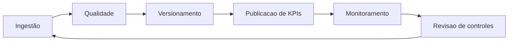

# Governança de Dados

## Objetivo
Estabelecer diretrizes para qualidade, rastreabilidade, segurança e uso responsável dos dados operacionais.

## Escopo
- Dados brutos, processados e outputs analíticos.
- Versionamento de execução e snapshots.
- Consumo de KPIs no dashboard e relatório executivo.

## Entradas
- Dataset de tickets.
- Regras de negócio e configuração de pipeline.
- SQL analítico para cálculo de métricas.

## Saídas
- Base tratada com histórico versionado.
- Evidências de execução (`manifest`, `pipeline_runs`).
- Indicadores de qualidade de dados.

## Riscos
- Perda de rastreabilidade de execução.
- Inconsistência entre métricas de diferentes camadas.
- Exposição indevida de campos sensíveis.

## Controles
- `run_id`, `snapshot_date` e `source_hash` por execução.
- Auditoria de qualidade (`data_quality_summary.json`).
- KPIs calculados por SQL para auditabilidade.
- Política de retenção recomendada para `raw`, `processed/snapshots` e `outputs/manifests`.
- Repositório privado/proprietário com controle de distribuição.

## Ciclo de governança

