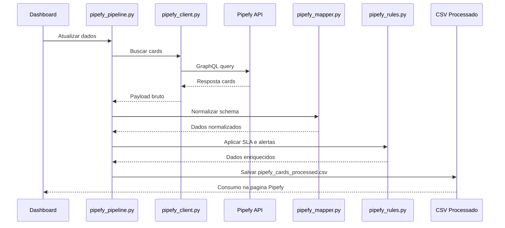

# Central de Automação e Operações - Integração Pipefy

## Arquitetura
A integração foi adicionada de forma modular em `integrations/pipefy` para não impactar o pipeline legado.

Fluxo:
1. `pipefy_client.py` consulta API GraphQL (ou mock local).
2. `pipefy_mapper.py` normaliza retorno para schema analítico.
3. `src/automation/pipefy_rules.py` aplica SLA, risco e recomendações.
4. `pipefy_pipeline.py` salva `data/processed/pipefy_cards_processed.csv`.
5. Dashboard consome esse dataset na seção `Inteligência Operacional com Pipefy`.
6. `pipefy_seed.py` permite criação automática de cards no Pipefy para bootstrap do ambiente.

## Diagrama da integração


## Fluxo de dados
- Entrada real: Pipefy GraphQL (`https://api.pipefy.com/graphql`).
- Entrada mock: `data/samples/pipefy_cards_sample.json`.
- Saída processada: `data/processed/pipefy_cards_processed.csv`.

## Modo mock
Ativo quando:
- `USE_PIPEFY_MOCK=true`; ou
- `PIPEFY_TOKEN` ausente; ou
- falha de autenticação/conexão na API.

## Modo API real
Requer:
- `PIPEFY_TOKEN`;
- `PIPEFY_PIPE_ID`;
- `USE_PIPEFY_MOCK=false`.

Comando:
```bash
python -m integrations.pipefy.pipefy_pipeline --pipe-id <PIPE_ID>
```

Seed automático se pipe estiver vazio:
```bash
python -m integrations.pipefy.pipefy_pipeline --pipe-id <PIPE_ID> --seed-if-empty --seed-count 30
```

## Segurança do token
- Token só via variável de ambiente.
- Nenhum token persistido em código, JSON, CSV ou logs.
- `.env` e `*.env` ignorados no repositório.

## Campos mapeados
- `ticket_id`, `title`, `source_system`, `category`, `priority`, `status`
- `current_phase`, `assignee`
- `created_at`, `updated_at`, `due_date`, `closed_at`, `days_open`
- `sla_status`, `risk_level`, `automation_alert`, `recommended_action`
- `card_url`

## Limitações atuais
- Consulta de cards sem paginação avançada.
- Algumas inferências de categoria/prioridade dependem da qualidade dos campos no Pipefy.
- Regra de card parado usa `updated_at` como proxy de movimentação.

## Próximas melhorias
- Paginação e ingestão incremental por `updated_at`.
- Cache local e persistência em DuckDB.
- Webhooks para near real-time.
- Mapeamento configurável por pipe/fase.
