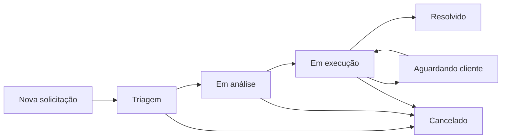

# Central de Automação e Operações - Modelo de Workflow Pipefy

## Modelo de workflow usado
Este projeto modela o Pipefy como camada operacional de execução de demandas:
- tickets e solicitações entram no pipe;
- cards percorrem fases com responsáveis e prazos;
- dados alimentam camada analítica para monitoramento e automação.

## Fases do processo
- Nova solicitação
- Triagem
- Em análise
- Em execução
- Aguardando cliente
- Resolvido
- Cancelado

## Diagrama de fases

## Campos principais dos cards
- Identificação: `id`, `title`, `url`
- Processo: `current_phase`, `labels`, `fields`
- Dono: `assignees`
- Tempo: `created_at`, `updated_at`, `due_date`, `finished_at`

## Conexão com dashboard
A seção `Inteligência Operacional com Pipefy` consome o CSV processado e exibe:
- KPIs operacionais e SLA;
- distribuição de backlog por fase, prioridade, categoria e responsável;
- heatmap fase x prioridade;
- alertas e recomendações automáticas;
- exportação de alertas para CSV.
